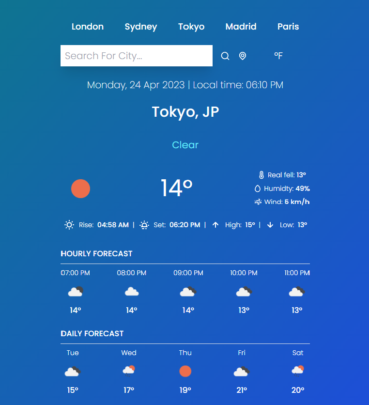

Weather-APP

To use this project, you'll need an API key from 'https://openweathermap.org/'

Instructions:

1. Clone the repository
2. Create a new file called '.env' in the root directory
3. Cope the content of the '.env.example' file into the new '.env'
4. Assign your API key to the REACT_APP_API_KEY environment variable in the .env file. For example: REACT_APP_API_KEY=myApiKey.
5. Save the .env file.
6. Run the project using the npm start command.

Make sure to replace 'myApiKey' with your actual API Key

